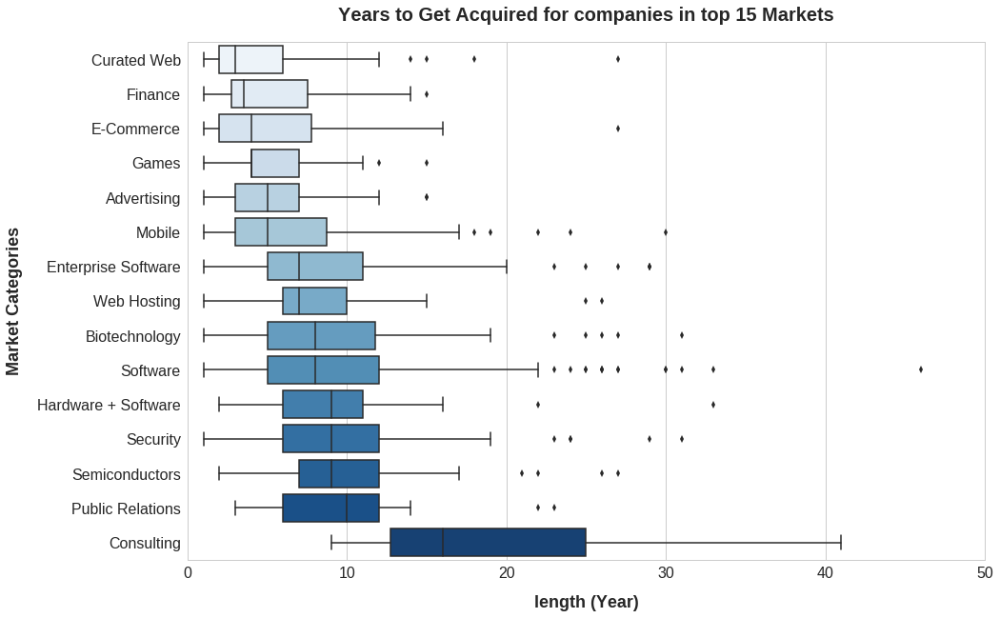

## US companies and industry landscape with Crunchbase  Data 
### Overview
In order to get a better understanding of companies and industry landscape in US,  we analyzed companies distributions, funding amounts, and aquisition trends in US using the Crunchbase data. 
The [jupyter notebook](https://github.com/YuexiSC/data-visualization/blob/master/crunch_base_viz.ipynb) file consists of the following sections: 
<li> Environment Configuration 
<li> Data Preparation 
<li> Data Visualization    
        
### Data 
This project used the following four datasets, which are available in  (**Datasource**: [Crunchbase data](https://data.crunchbase.com/docs) ) 

|Table | Number of Entries |Contents |
|--|--|--|
| `company` |49,438  | <li>regional information <li>market/ industry information<li>funding status  |
|`investment` |114,506|<li>companies's information <li>investor's <li>funding information |
| `acquisition` |  55,240|<li>companies and its acquirer's  information <li>price_amount of money the acquirer paid|
|`rounds `|83,870|<li>companies' information <li>funding status <li>amount of money rasied|


### Tech Stacks
The project is written in Python 3.6 with Google Colaboratory tool. We used pandas and numpy for data analysis, and used seaborn, worldcloud and matplotlib for data visualization.
```
import pandas as pd
import numpy as np
import seaborn as sns
import matplotlib.pyplot as plt
% matplotlib inline
import warnings
from wordcloud import WordCloud
warnings.filterwarnings('ignore')
from IPython.display import Image
import matplotlib.image as mpimg
 ```

## Highlights 
The highlighted findings with plots from jupyter notebook are as follows: 
1. The number and distribution of US companies    
*The total number of companies in each state in US from 1960-2014*  
>1. This graph was generated using Tableau, showing a basic regional distribution of the companies in US. 
>2. California has the most number of companies, the number of which is way greater than the second state, New York.
 

2. Number of companies founded and got acquired (2000 -2013)    
 *The trend of the number of companies founded and acquired over the years.*

>1.   Entrepreneurship is on an upward trend. 
>2. Whether the crises have impacts on Entrepreneurship trend:    
>>1) we can see there is a slow down but no expected sharp decrease in the number of companies founded and acquired. And after financial crisis in 2008, there is a continuous climbing up of number of companies founded, looks like an economic revival, but the acquisition activities slow down a little bit.      
>>2) However, after crisis of 2012, the number of companies founded has a sharp decrease. We can tell the crisis that countries and banks struggle to get balances sheets has much negative impact on starting a company. In the contrast, acquisition activities have increased slightly.   


3. The trend of market with popular acquisition target from 2007 to 2014    
*How the number of acquired companies in Top 5 market changes over time?* 
>1.   Number of acquisition on mobile is steadly growing
> 2. There are cheap acquisitions for curated web companies and pure software companies



